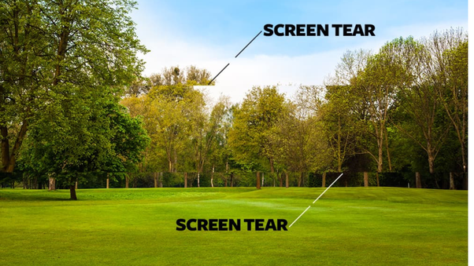
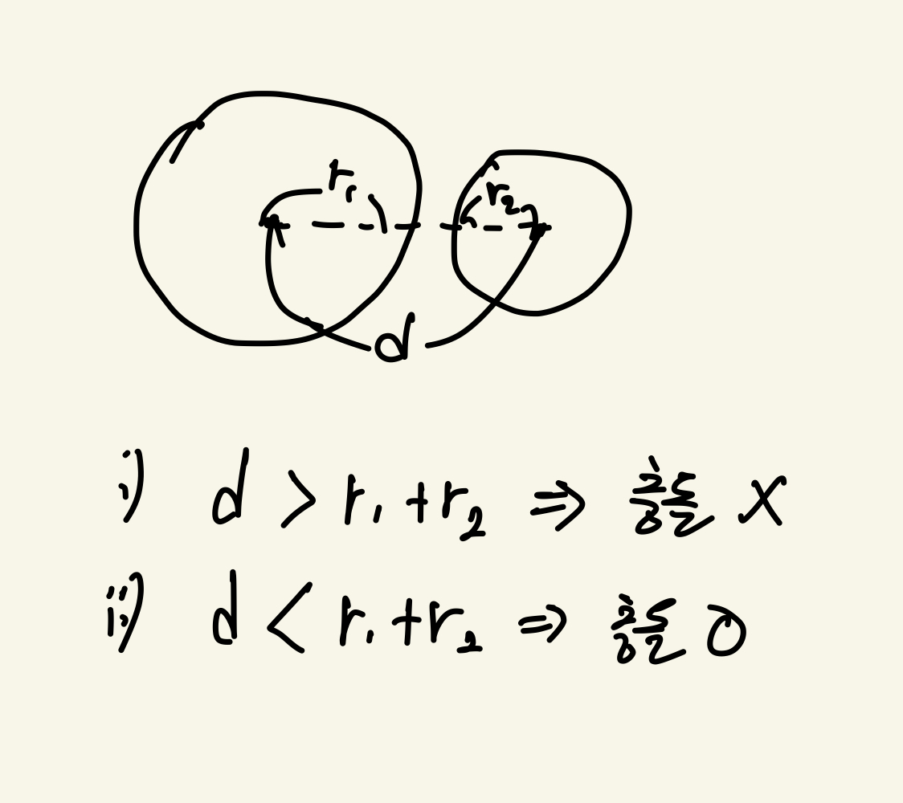
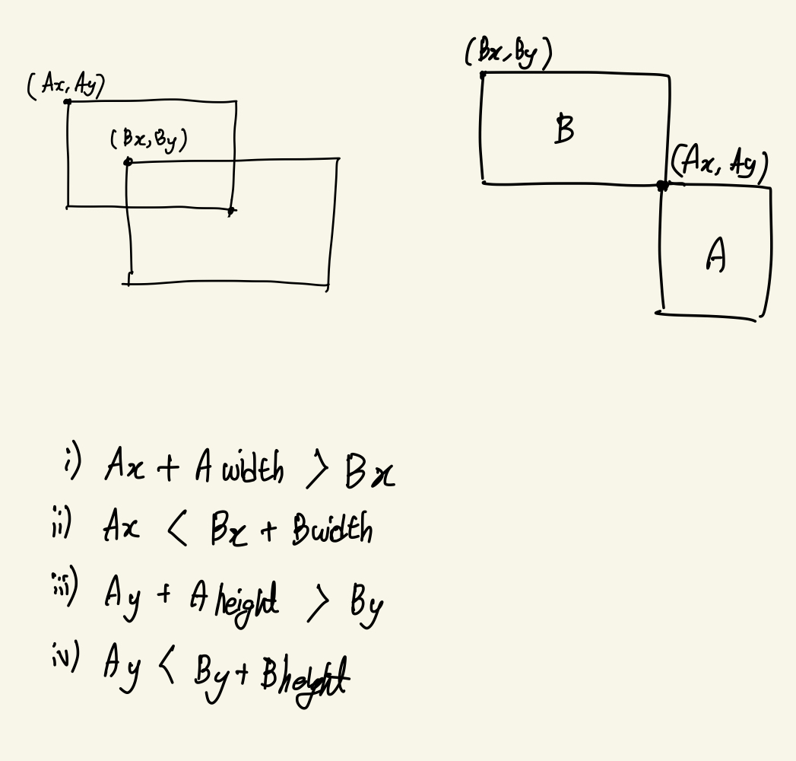

<!-- toc -->

-   [simple_2d_game_engine](#simple_2d_game_engine)
    -   [configure](#configure)
        -   [deps](#deps)
    -   [game things](#game-things)
        -   [VSync (vertical sync, 수직 동기화)](#vsync-vertical-sync-수직-동기화)
        -   [Double-Buffered Renderer](#double-buffered-renderer)
        -   [Fixed Time Step(Frame Rate Independence) game loop](#fixed-time-stepframe-rate-independence-game-loop)
        -   [Variable Delta-Time (frame drop compensate with delta time)](#variable-delta-time-frame-drop-compensate-with-delta-time)
        -   [Determinism](#determinism)
        -   [ECS(Entity Component System)](#ecsentity-component-system)
            -   [component의 memory contiguous한 배치와 Pool](#component의-memory-contiguous한-배치와-pool)
            -   [pool의 data gap을 제거하는 방안 (개선안)](#pool의-data-gap을-제거하는-방안-개선안)
            -   [DOP (data-oriented programming)](#dop-data-oriented-programming)
            -   [array of struct(AOS) vs struct of array(SOA)](#array-of-structaos-vs-struct-of-arraysoa)
        -   [event system](#event-system)
            -   [비동기 프로그래밍과 pub-sub](#비동기-프로그래밍과-pub-sub)
        -   [collision check](#collision-check)
            -   [circle collision detection](#circle-collision-detection)
            -   [AABB collision detection](#aabb-collision-detection)
    -   [language interoperability(언어 간 상호 운용성)](#language-interoperability언어-간-상호-운용성)
    -   [SLD2](#sld2)
        -   [paths](#paths)
        -   [full screen, fake full screen](#full-screen-fake-full-screen)
        -   [rendererFlags and hardware acceleration](#rendererflags-and-hardware-acceleration)
        -   [surface vs texture](#surface-vs-texture)
    -   [etc](#etc)
        -   [UI paradigm (retain vs immediate)](#ui-paradigm-retain-vs-immediate)
        -   [OTF(OpenType Font), TTF(TrueType Font)](#otfopentype-font-ttftruetype-font)
        -   [lldb 두 번 쓰세요](#lldb-두-번-쓰세요)
    -   [known issues](#known-issues)
    -   [개인적인 coding convention이나 기타 개발 관습에 대해](#개인적인-coding-convention이나-기타-개발-관습에-대해)
    -   [resources](#resources)

<!-- tocstop -->

# simple_2d_game_engine

## configure

### deps

```bash
brew install sdl2 sdl2_image sdl2_ttf sdl2_mixer lua
```

## game things

### VSync (vertical sync, 수직 동기화)

아래와 같은 tearing은 게임이 매 프레임마다 렌더링을 하는 사이 모니터의 refresh rate(주사율, 재생률) 과 맞지 않아서 그리는 도중을 보여줘서 보이는 현상임.



이를 위해 게임 렌더러의 프레젠테이션(화면에 그리는 것)을 모니터의 refresh rate와 동기화하는 기술이 vsync이며 결과적으론 tearing을 방지 한다.

추가로, GPU가 모니터의 refresh rate보다 더 많은 프레임을 렌더링하지 않도록 제한함으로써, 불필요한 GPU 부하를 줄일 수도 있다.

문제는 모니터의 refresh rate가 60Hz라면, 게임의 fps는 60fps로 제한되며 (60fps 이상으로 렌더링해도 60fps 이상이라고 인식하지 못함. 애초에 주사율이 초당 60번 refresh되니까.) 만약 60fps를 못 맞춘다면 나누어 떨어지는 30fps로 렌더링됨. 결국 GPU가 힘들면 fps가 낮아짐.

### Double-Buffered Renderer

back buffer와 front buffer의 이중 운용.  
draw를 back buffer에서 먼저하고 front buffer로 swap하는 방식.  
glitch를 방지하고, 렌더링이 완료되지 않은 프레임은 화면에 보여지지 않는 장점이 있음.

### Fixed Time Step(Frame Rate Independence) game loop

아래 코드는 while loop를 도는데 구동되는 컴퓨터의 CPU 성능에 의존적이다.
즉, 게임을 구동하는 클라이언트마다 동일한 게임 경험을 줄 수 없다는 것을 의미한다.

```cpp
void Game::RunGameLoop() {
    Game::Setup();
    while (mIsRunning) {
        Game::ProcessInput();
        Game::Update();
        Game::Render();
    }
}
```

이 문제에 대한 해결책으로

-   고정 프레임 레이트 업데이트
-   시간 기반 업데이트
-   등... 이 존재한다.

### Variable Delta-Time (frame drop compensate with delta time)

unity, love2d 등 웬만한 게임 엔진은 game loop를 메서드 형식으로 노출하고 있다. 그 중에서도 update는 frame마다 호출된다.

따라서, fps가 하락하면 update 호출 횟수도 줄어듦. frame이 바뀌어도 동일한 정도로 움직이게 만들어야 함.

즉, 다른 frame rate에서도 속도 등이 frame rate에 영향을 받지 않게 만들어야 한다.

해결 방법의 핵심 : if frame rate drop, should be compensate for it.

-   case 1. 60fps -> 30fps
    update 호출이 덜 일어나지만 dt가 늘어났으므로 dt를 곱하여 compensate.

-   case 2. 60fps -> 120fps
    update 호출이 더 자주 일어나지만 dt가 줄어들었으므로 dt를 곱하면 compensate됨.

-   dt를 곱함으로써 frame rate에 영향을 받지 않고, '초' 단위로 속도를 조절할 수 있게 됨.

    ```lua
    -- 17pixel per second
    player.x = player.x + 17 * dt
    ```

### Determinism

어떤 것이 Deterministic 하다는 것은, 동일한 입력을 제공할 때마다 정확히 동일한 출력이 되돌아오는 것을 의미한다.

대부분 컴퓨터에서는 결정적인 것이 많으므로 비결정적인 것을 살펴보는 것이 더 빠르다. 멀티 쓰레딩, 네트워크, 가변 delta time을 활용한 compensating 등이 비결정적이다. 멀티 쓰레딩을 해봤다면, 동일한 queue에 데이터를 각 쓰레드가 데이터를 던졌다면, 그 순서가 매 실행마다 달라지는 것을 체험해봤을 것이다.

여기서는 게임을 다루고 있으니 variable delta time에 대해서 이야기해보자. variable delta time을 활용했다면 비결정적이다. 왜냐하면, 동일한 입력을 제공했을 때마다 다른 delta time이 반환되기 때문이다.

결정적인 constant delta time을 이용하려면 단순히 `1 / fps`를 활용하면 된다.

### ECS(Entity Component System)

box(entity)에 box collider(component)를 넣어 특성을 부여하는 식의 구현은 unity을 비롯한 게임 엔진에서 흔히 볼 수 있는 시스템.

data-oriented design을 통해 cache-friendly하게 구현하느 것이 목표임. 따라서 OOP와는 다른 구조를 가짐.

OOP와 ECS의 가장 큰 차이점은, OOP에서는 base class와 derived class간의 상속과 위계가 강조되지만 ECS에서는 Component가 데이터를 소유하고, 엔티티는 단순히 컴포넌트의 컨테이너 역할을 한다는 것입니다.

-   Entity(id)

    -   게임 내의 모든 객체나 아이템은 엔티티로 표현됩니다. 엔티티 자체는 단순히 고유 식별자(ID)를 가진 컨테이너에 불과하며, 실제로는 아무런 데이터나 행동을 직접 가지지 않습니다.

-   Component(data)

    -   pure data
    -   pure data라는 관점에서 plain old data(POD)를 표현하기 위한 struct로 구현하는게 잘 어울린다. 그 과정에서 memory padding을 고려하는 것이 좋다. (#pragma pack을 활용하거나 수동으로 구조체 멤버의 순서를 조정하자.)
    -   그러나 여러 기능 때문에 class로 구현이 되곤 한다.
    -   컴포넌트는 엔티티의 데이터를 나타냅니다. 예를 들어, 위치, 속도, 건강 상태 등과 같은 속성들이 컴포넌트로 표현됩니다. 이들은 엔티티에 첨부되어 엔티티의 상태를 정의합니다.

-   System(transform data logic)
    -   entity는 id, component는 data, system은 behavior를 담당한다. 즉, component의 상태 데이터를 변경하는 것이 system의 역할이다.

#### component의 memory contiguous한 배치와 Pool

ECS에서는 컴포넌트를 사용하여 데이터를 저장합니다. 이 컴포넌트들은 종종 메모리 상에서 연속적으로 배치됩니다. 즉, memory contiguity (메모리 연속성)를 지키도록 배치됩니다.

쉽게 말해서 [comp, comp, comp, comp, ...] 와 같은 꼴입니다.

-   캐시 친화적 접근: 시스템이 특정 컴포넌트 유형을 작업할 때, 연속된 메모리 레이아웃 덕분에 캐시 효율성이 높아집니다. 예를 들어, 물리 시스템이 모든 위치 컴포넌트를 순차적으로 처리할 때, 연속된 메모리 레이아웃은 캐시 적중률을 높여 성능을 향상시킵니다.

-   데이터 지향 설계: ECS는 데이터 지향 설계 원칙을 따릅니다. 이는 데이터를 중심으로 시스템을 구성하여, 메모리 접근 패턴을 최적화하는 것을 목표로 합니다. 이러한 접근 방식은 메모리 연속성을 중시합니다.

생각해보면, memory contiguous한 자료구조(vector, array, ...)에 객체를 넣기만 하면 이를 달성할 수 있을 것으로 보인다. 이의 구현체를 관습적으로 `Pool`이라고 부른다. (DB connection 비용 아끼려고 만드는 pool과는 맥락이 다르니 이해에 주의)

ECS 시스템에서의 Pool이란 `컴포넌트를 저장, 관리하기 위한 메모리 저장 영역`을 의미한다.

Pool 방식으로 관리함으로써 동일한 유형의 컴포넌트를 연속된 메모리 공간에 저장하여 memory contiguity를 달성함으로써, 메모리 할당 및 해제를 최적화하고, 캐시 효율성이 향상된다.

Pool의 구현은 단순히 memory contiguous한 자료구조(vector, array, ...)에 객체 혹은 식별자를 넣은 것에 불과하다.

해당 엔진에서의 Pool은 (entity의 갯수, component의 갯수)의 이차원 배열 꼴로 아래와 같이 구성된다.

| Entity / Component | CompA | CompB | CompC |
| ------------------ | ----- | ----- | ----- |
| Entity 0           | CompA | CompB |       |
| Entity 1           | CompA |       | CompC |
| Entity 2           | CompA | CompB |       |
| Entity 3           | CompA | CompB | CompC |

사실, 이러한 구성은 entity가 가지고 있지 않은 component 부분에 대해서 data cap을 가진, 즉, 메모리를 낭비하는 부분이 있다.

#### pool의 data gap을 제거하는 방안 (개선안)

즉, component pool을 packed하게 관리해야 한다.
위 방식에 data gap이 발생하는 이유는, 단순히 entityId를 index로 사용하고 있기 때문이다.

가장 간단한 방식으로 해결하려면, entity-index 간 상호 변환 가능한 양방향 맵을 운영하는 것.

#### DOP (data-oriented programming)

게임 관련 프로그램은 말 그대로 `squeeze performance out of hardware`를 목표로 한다. 보통 CPU cache hit rate를 높이는 것이 목표이다. 따라서 data locality를 위해 memory contiguity한 처리를 중시한다.

cache fail하면 memory hierarchy 하위인 매체로 접근해야 하는데 (CPU -> RAM -> Disk) 각 매체는 용량과 속도를 trade off한 것이므로 속도가 자연스레 느리다.

-   [CppCon 2014: Mike Acton "Data-Oriented Design and C++"](https://www.youtube.com/watch?v=rX0ItVEVjHc&ab_channel=CppCon)
-   [초보개발자 데이터지향 설계(Data Oriented Design) 알아보기](https://monday9pm.com/%EC%B4%88%EB%B3%B4%EA%B0%9C%EB%B0%9C%EC%9E%90-%EB%8D%B0%EC%9D%B4%ED%84%B0%EC%A7%80%ED%96%A5-%EC%84%A4%EA%B3%84-data-oriented-design-%EC%95%8C%EC%95%84%EB%B3%B4%EA%B8%B0-c0bbd36ea9da)
-   [Game Performance: Data-Oriented Programming](https://android-developers.googleblog.com/2015/07/game-performance-data-oriented.html)

#### array of struct(AOS) vs struct of array(SOA)

```cpp
// AOS. 흔히 짜던 방식이고 직관적
struct ThreeDimensionalVector {
    double x, y, z;
};
std::array<ThreeDimensionalVector, 1024> arrayOfStruct;

// SOA. DOD에서의 방식
struct structOfArrays {
    std::array<double, 1024> x;
    std::array<double, 1024> y;
    std::array<double, 1024> z;
};
```

AOS 방식은, x, y, z가 동시에 다 바뀌어야 할 때 유용한 편
SOA 방식은, 어느 한 축의 값만 바뀌는 경우가 많을 때 유용한 편

-   특정 시스템, 로직은 보통 객체의 한 멤버 변수에만 관심이 있을 때가 많다. 아이템의 수량만 바꾸지, 수량과 이름을 동시에 바꿀만한 경우는 드물다. 그래서 DOD 관점에선 SOA가 더 자주 사용되는 편이라고 한다.

    -   메모리 레이아웃으로 따지자면, AOS는 [(x, y, z), (x, y, z)] 꼴일 터이고, SOA는 [x, x, x, ...], [y, y, y, ...], [z, z, z, ...] 와 같은 꼴일 터이다. 특정 로직이 x, y, z가 다 필요하면 AOS 방식이 data locality 측면에서 유리할 것이고, 특정 필드에만 자주 접근하는 경우 SOA 방식이 유리할 것이다.

-   해당 시스템에서는 직관적인 AOS 방식을 사용하였다. 어.. 사실 뭘 사용하는 지 확실하게 정하는 건 프로파일링을 통해서 성능 차이가 확연한 이점이 있을 때 하는게 좋다고 생각한다. don't premature optimization.

### event system

#### 비동기 프로그래밍과 pub-sub

비동기 프로그래밍을 구현하는 패턴으로 다음과 같은 것을 들 수 있겠다.

-   coroutine, generator
    -   python 이야기를 하자면, coroutine(generator based), native coroutine(async/await)로 분리할 수 있겠다.
    -   javascript의 generator는 엄밀히 말하자면 coroutine은 아니다. sub routine간의 양방향 전환이 안되기 때문에 제한된 coroutine이다.
-   promise(future)
-   callback
    -   그것이 event loop를 타는 것이든(node, python) 단순히 함수 포인터로 호출하는 방식이든(c/cpp)
-   reactive programming(rx)
-   observer pattern
    -   엄밀히 이야기하면, pub-sub과는 조금 다르다. pubsub은 event channel(이벤트 버스)를 통해 이벤트를 전달하는 것이고, observer pattern은 subject가 observer에게 직접 이벤트를 전달하는 것이다.

거칠게 요약하자면 비동기 프로그래밍은 pub-sub 패턴의 변형이다.
본 엔진에서 구현되는 이벤트 시스템도 pub-sub 패턴의 변형이다.

어떠한 topic에 대해 subscribe하고 어떤 동작을 지정하면,
eventBus가 각 이벤트의 리스너와 콜백의 목록을 관리하고, 이벤트를 전송하는 역할을 한다.
그리고 이벤트 emit(publish) 되는 시점에 동작이 실행된다.

### collision check

이 엔진에선 box collider로 감싼 entity의 충돌을 AABB collision check로 확인함.

#### circle collision detection

단순하게, 원의 중심점 사이의 거리가 반지름의 합보다 작으면 충돌이 발생한 것으로 간주한다.



#### AABB collision detection

AABB (Axis-Aligned Bounding Box) collision check는, 단순히 entity를 감싼 collider 가 겹치는 가를 확인하는 로직이다.

박스 A, 박스 B가 존재한다고 가정할 때 두 영역이 충돌(영역 겹침) 확인 조건.



1. A의 최대 X 좌표(A.x + A.width)가 B의 최소 X 좌표(B.x)보다 커야 함
2. A의 최소 X 좌표(A.x)가 B의 최대 X 좌표(B.x + B.width)보다 작아야 함
3. A의 최대 Y 좌표(A.y + A.height)가 B의 최소 Y 좌표(B.height)보다 커야 함
4. A의 최소 Y 좌표(A.y)가 B의 최대 Y 좌표(B.y + B.height)보다 작아야 함

## language interoperability(언어 간 상호 운용성)

다른 언어간의 바인딩 작업은, 개발 전략적으로 중요하다.

core engine은 성능을 위해 저수준 언어로 개발하고, 상위 추상화 계층에선 script 언어를 사용하는 패턴은, 게임 엔진 뿐만 아니라 tensorflow, pytorch와 같은 계산-intensive한 프레임워크에서도 많이 사용되는 패턴이다.

이를 구현하는 방법을 생각해보자면 아래 정도가 있겠다.

-   FFI(Foreign Function Interface)가 지원되면 사용하거나 (Deno 같은 경우에는 내장으로 FFI를 지원한다.)
-   스크립트 언어를 embedding하거나,
-   binary를 통으로 불러와서 아예 실행하던가,
-   서로 다른 책임을 가진 두 언어로 만들어진 프로그램을 실행하여 프로세스 간에 통신하거나(이 방법은 언어 간 상호 운용이라는 측면에서는 좀 벗어난 측면이 있지만)

해당 엔진에서는 sol을 통해 간단하게 cpp과 lua 간의 바인딩을 구현하였다.

## SLD2

### paths

```bash
# sd2 check
sdl2-config --version # 2.28.5

sdl2-config --libs
# 링커 플래그 제공
# 링커가 SDL2 라이브러리를 찾고 링크하는 데 필요한 설정을 제공합니다

sdl2-config --cflags
# 컴파일러 플래그 제공
# SDL2 헤더 파일의 경로를 출력.
# 컴파일러가 SDL2의 헤더 파일을 찾을 수 있도록 해줍니다.

sdl2-config --libs --cflags # 동시에 출력

# 현재 맥 환경에선 --cflags가 -I/opt/homebrew/include/SDL2 -D_THREAD_SAFE 를 출력함.
# 문제는 이렇나 방식이면 #include <SDL.h> 방식으로 include해야 함.
clang++ -Wall -std=c++17 Main.cpp $(sdl2-config --libs --cflags) -o Main

# 코딩 컨벤션에 맞게 <SDL2/SDL.h> 로 사용하기 위해 -I 옵션을 수정하여 아래처럼 적용함.
clang++ -Wall -std=c++17 Main.cpp -L/opt/homebrew/lib -lSDL2 -I/opt/homebrew/include -D_THREAD_SAFE -o Main

```

### full screen, fake full screen

full screen은 다른 화면 전환이 번거로움. (전체 화면)
Fake Fullscreen은 사실상 크기를 조정한 창 모드. (전체 창모드)

-   SDL_WINDOW_FULLSCREEN
    -   전체 화면. SDL이 해상도를 변경하여 전체 화면으로 만듬.
    -   화면 전환 시 느림. (게임 하다가 ctrl + tab으로 전환하려고 하면 해상도 깨졌다가 다시 복구되는 그것.)
-   SDL_WINDOW_FULLSCREEN_DESKTOP
    -   fake full screen으로, 해상도 변경 없이 전체 화면처럼 보이게 함.
    -   전체 화면을 채우는 보더리스 창을 생성하는 것과 유사.
-   SDL_WINDOW_BORDERLESS
    -   전체 화면과 크게 관련 없으나 전체 화면을 꽉 채우는 borderless 창을 생성하는 것과 유사.

### rendererFlags and hardware acceleration

SDL_CreateRenderer에서 GPU 사용이 가능

[SDL_RendererFlags](https://wiki.libsdl.org/SDL2/SDL_RendererFlags) 참고.

-   SDL_RENDERER_SOFTWARE : 하드웨어 가속 사용 안하고 CPU 사용
-   SDL_RENDERER_ACCELERATED : dedicated graphics card (GPU) 사용
-   SDL_RENDERER_PRESENTVSYNC : VSync 사용. tearing 방지
-   SDL_RENDERER_TARGETTEXTURE

```cpp
SDL_CreateRenderer(
    window,
    -1,
    SDL_RENDERER_ACCELERATED
);
```

### surface vs texture

SDL_Surface는 이미지 처리나 간단한 소프트웨어 렌더링에 적합하고, SDL_Texture는 GPU를 사용한 빠른 화면 렌더링에 적합합니다.

일반적으로 이미지 파일을 로드하고 조작할 때는 SDL_Surface를 사용하고, 화면에 이미지를 렌더링할 때는 SDL_Texture로 변환하여 사용합니다.

SDL_Surface는 시스템 메모리(RAM)에 저장되고, SDL_Texture는 GPU의 비디오 메모리(VRAM)에 저장됩니다.

## etc

### UI paradigm (retain vs immediate)

-   retain mode(RMGUI)  
    web에서 vanilla js로 DOM을 구성하는 것과 비슷하다.
    UI 요소를 객체로 보고, UI가 바인딩한 데이터의 변화에 따른 변화를 처리하도록 해당 객체를 구성해야 한다. 따라서 해당 UI가 state의 변화 로직과 변화에 따른 렌더링 로직을 모두 가지고 있어야 한다.

    -   UI의 상태가 지속적으로 저장 및 관리되어야 하는 경우 사용
    -   UI와 데이터를 바인딩(sync)하여 사용하는 대부분의 SPA 프레임워크의 방식

-   immediate mode(IMGUI)  
    게임 루프에 UI 렌더링을 태워서 UI를 새롭게 그려낸다. 그래서 UI가 데이터를 직접적으로 소유하지 않고 바인딩하는 것도 없다.

[About the IMGUI paradigm](https://github.com/ocornut/imgui/wiki/About-the-IMGUI-paradigm)

### OTF(OpenType Font), TTF(TrueType Font)

둘 다 많이 쓰이는 폰트 포맷이다.  
OTF는 TTF보다 더 많은 기능을 제공하는 대신 더 큰 용량을 차지하곤 하며,
오래된 브라우저에서는 지원하지 않는 경우도 있다.

### lldb 두 번 쓰세요

-   `b [function-name]` 나 `b [file]:[line]`로 의심되는 지점을 건다.
-   `r`로 실행한다.
-   다음과 같은 도구들을 이용해본다
    -   뭔가 터지면 `bt`로 스택 트레이스를 확인한다.
    -   문제가 되는 메모리 공간을 `memory read [주소]`로 확인한다.
    -   `expr [변수명] = [새로운 값]`으로 새로운 값으로 변경해본다
    -   `expr [변수명]` 혹은 `p [변수명]` 으로 변수를 확인해본다
    -   `frame variable [변수명]`, `fr v [변수명]`으로 현 프레임에서의 변수의 값을 확인한다.

## known issues

-   다중 모니터 문제

    -   전체 화면 문제
        monitor 0, 1 두 개의 모니터가 존재할 때,
        monitor 0에서 전체 화면 게임을 실행하면 monitor 1은 어떻게 해야 하는가? (모니터에 따라 동작이 다른 것을 확인)

    -   화면 분할 문제

        내장 모니터가 3456 x 2234임에도 화면 분할 기능을 사용하면 1728 x 2234로 나눠지게 된다.
        전체 화면 게임을 실행할 경우 어떻게 대처할 것인가?

## 개인적인 coding convention이나 기타 개발 관습에 대해

-   여기서는 struct와 class를 혼용하였다. 그러나 struct는 POD만을 담도록 하는 것이 좋다고 생각한다.
-   c lib는 smart pointer로 wrapping하지 않는다.
-   여기서는 대입을 통해 멤버 변수를 초기화한 부분이 있으나 가급적 initializer list를 사용하는 것이 좋다고 생각한다.
-   IDE로 vscode를 사용 중인데, c/c++ extension가 제공해주는 intellisense가 아주 느리다. [clangd](https://clangd.llvm.org/) 사용을 권장하며, 사용하는 빌드 시스템 툴에 따라 compile_commands.json을 생성하여 사용하자.
-   enum 보다 enum class가 strongly typed기도 하고, enum의 class를 명시하는 효과가 있어서 더 자주 사용하는 편이다. 특히, 타 언어에서 그런 표기법을 사용하는 경우가 많아서 익숙하다.
-   DO NOT USE EXCEPTION. just let engine crash.
-   타 언어일 때는 inlay hints가 지저분해보였는데 c/cpp에서는 이게 없으면 코드 읽기가 더 힘들어지는 듯. 활성화 추천.

## resources

-   [Nomad Game Engine](https://savas.ca/nomad)
-   [A SIMPLE ENTITY COMPONENT SYSTEM (ECS) [C++]](https://austinmorlan.com/posts/entity_component_system/)
-   [MIX(C++ minimal ECS)](https://github.com/arvidsson/Mix)
-   [murder game engine](https://github.com/isadorasophia/murder)
-   [EnTT (for C++ projects)](https://github.com/skypjack/entt)
-   [Flecs (for C projects)](https://github.com/SanderMertens/flecs)
-   [SDL 프로그래밍 컴플리트 가이드](https://wikidocs.net/book/6636)
-   https://gafferongames.com/post/fix_your_timestep/
-   https://denyskryvytskyi.github.io/event-system
-   https://gameprogrammingpatterns.com/contents.html
